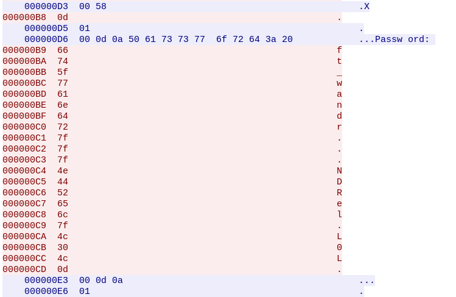

# Recherche des fichiers disponibles

Avec la commande ls on trouve le fichier **level02.pcap** dans le home de l'utilisateur **level02**.

```bash
level02@SnowCrash:~$ ls
level02.pcap
```

Avec une petite recherche sur le web, on apprend que c'est un format de fichier pour stocker des captures de paquets.

Wireshark est l'un des logiciels pouvant ouvrir et analyser ce type de fichier.

# Récupération du fichier

```bash
scp -P 4242 level02@192.168.XXX.XXX:/home/user/level02/level02.pcap /tmp/
chmod +r /tmp/level02.pcap
```

Maintenant on peut ouvrir le fichier avec Wireshark.

# Wireshark

Dans Wireshark, on peut apercevoir plusieurs paquets, dont certains contenant du texte avec **login** et **password**.

En analysant le stream TCP, on peut voir une suite de caractères ressemblant à un mot de passe.



Attention, les points ne font pas partie du mot de passe mais sont des caractères de contrôle.

A l'aide de la table ASCII, on trouve que :
- 0D = Carriage Return
- 7F = Delete

En respectant les caractères de contrôle, on obtient le mot de passe : **ft_waNDReL0L**.

# Getflag

On n'a plus qu'à récupérer le flag via l'utilisateur **flag02** avec ce mot de passe.

```bash
su -c getflag - flag02
```
